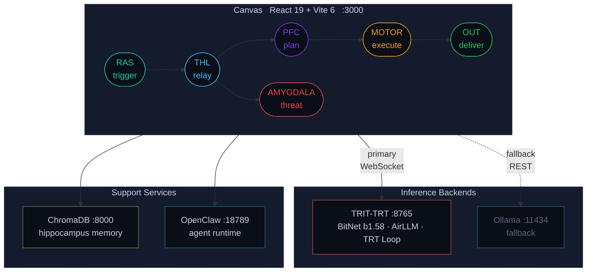
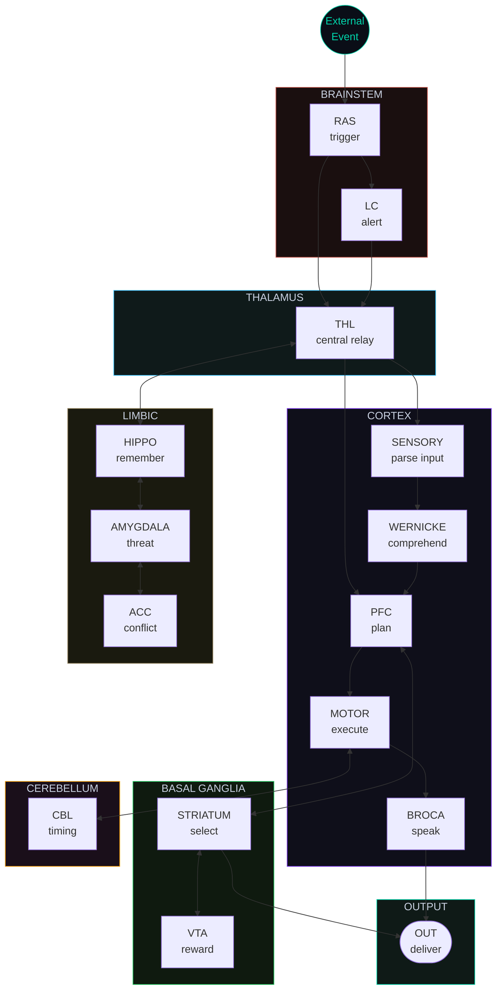
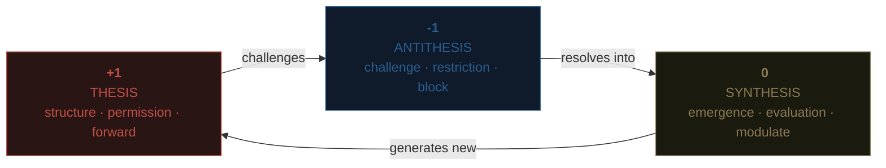
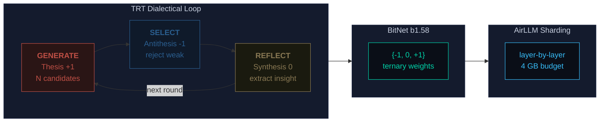
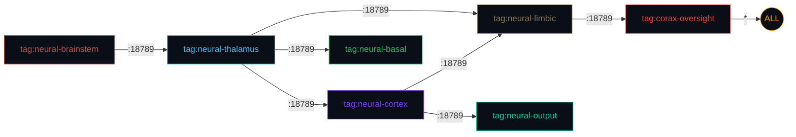

<p align="center">
  <br />
  <br />
  <picture>
    <source media="(prefers-color-scheme: dark)" srcset="https://img.shields.io/badge/%E2%9C%A6-NEURAL--CLAW-00D4AA?style=for-the-badge&labelColor=0A0E17&color=00D4AA">
    
  </picture>
  <br />
  <br />
  <em>Brain-modeled multi-agent orchestration.<br />Local-first. Ternary-native. Sovereign.</em>
  <br />
  <br />
</p>

<p align="center">
  <a href="#-what-is-this"><strong>What</strong></a> &ensp;&middot;&ensp;
  <a href="#-quickstart"><strong>Quickstart</strong></a> &ensp;&middot;&ensp;
  <a href="#-architecture"><strong>Architecture</strong></a> &ensp;&middot;&ensp;
  <a href="#-the-brain"><strong>Brain</strong></a> &ensp;&middot;&ensp;
  <a href="#-mizu-dialectics"><strong>MIZU</strong></a> &ensp;&middot;&ensp;
  <a href="#-trit-trt"><strong>TRIT-TRT</strong></a> &ensp;&middot;&ensp;
  <a href="#-canvas-ui"><strong>Canvas</strong></a> &ensp;&middot;&ensp;
  <a href="#-deployment"><strong>Deploy</strong></a> &ensp;&middot;&ensp;
  <a href="#-roadmap"><strong>Roadmap</strong></a>
</p>

<p align="center">
  <a href="https://github.com/Mavioni/NeuralClaw/blob/main/LICENSE"></a>
  <a href="#-quickstart"></a>
  <a href="canvas/package.json"></a>
  <a href="trit-trt/"></a>
  <a href="trit-trt/requirements.txt"></a>
  <a href="canvas/vite.config.js"></a>
</p>

<br />

---

<br />

## &nbsp; What is this?

**NEURAL-CLAW** is a visual multi-agent orchestration system where AI agents are mapped to regions of a biological brain. You drag brain regions onto a canvas, wire them together with synapses, and watch signals propagate through an anatomically-correct neural architecture — all running locally on your hardware.

Every signal carries a **ternary trit vector**. Every model weight is a **ternary value**. Every reasoning step follows the **dialectical loop**: generate, challenge, synthesize. The philosophy isn't a metaphor — it's the implementation.

```
You build a brain. You give it a task. It thinks.
```

<br />

## &nbsp; Quickstart

<details open>
<summary><strong>One-command deploy (production)</strong></summary>
<br />

```bash
git clone --recurse-submodules https://github.com/Mavioni/NeuralClaw.git
cd NeuralClaw
sudo bash setup.sh
```

This will:
1. Create a hardened `openclaw` user
2. Install Tailscale + Docker
3. Configure UFW firewall (default-deny)
4. Harden SSH (key-only, port 2222)
5. Build and launch the full stack
6. Download the BitNet b1.58 ternary model (~500 MB)

</details>

<details>
<summary><strong>Manual setup (development)</strong></summary>
<br />

```bash
# Clone with submodules
git clone --recurse-submodules https://github.com/Mavioni/NeuralClaw.git
cd NeuralClaw

# Start infrastructure
docker compose up -d ollama trit_trt hippocampus

# Launch canvas dev server
cd canvas
npm install
npm run dev        # → http://localhost:3000
```

</details>

<details>
<summary><strong>Verify services</strong></summary>
<br />

```bash
# Check all services
docker compose ps

# Test TRIT-TRT inference engine
curl http://localhost:8765/health

# Test Ollama fallback
curl http://localhost:11434/api/tags
```

</details>

<details>
<summary><strong>Requirements</strong></summary>
<br />

| Requirement | Minimum | Recommended |
|:------------|:--------|:------------|
| **RAM** | 4 GB | 8 GB+ |
| **Disk** | 2 GB | 5 GB |
| **GPU** | None (CPU works) | Any with 4 GB VRAM |
| **OS** | Ubuntu 22.04+ / macOS / WSL2 | Ubuntu 24.04 LTS |
| **Docker** | 24.0+ | Latest |
| **Node.js** | 20+ | 22 LTS |
| **Python** | 3.10+ | 3.12 |

</details>

<br />

## &nbsp; Architecture



<details>
<summary><strong>Stack breakdown</strong></summary>
<br />

| Layer | Technology | Role |
|:------|:-----------|:-----|
| **Canvas** | React 19 + Vite 6 | Visual drag-and-drop brain builder |
| **Inference** | TRIT-TRT (BitNet b1.58) | Ternary-native dialectical reasoning |
| **Fallback** | Ollama | Standard local LLM when TRIT-TRT unavailable |
| **Runtime** | OpenClaw | ReAct agent loop, tool execution, WebSocket API |
| **Memory** | ChromaDB | Vector store for hippocampus episodic memory |
| **Network** | Tailscale | Encrypted mesh VPN with anatomical ACLs |
| **Security** | seccomp + UFW + Docker | Defense-in-depth container isolation |

</details>

<br />

## &nbsp; The Brain

NEURAL-CLAW models multi-agent orchestration as a biological nervous system. Each of the **16 agents** maps to an anatomical brain region with a specific cognitive function. Signals flow through biologically-plausible pathways — you can't skip the thalamus.



### Agent Registry

<details open>
<summary><strong>Brainstem</strong> — <code>RAS</code> <code>LC</code></summary>
<br />

| Agent | Region | Function | Type | Backend |
|:------|:-------|:---------|:-----|:--------|
| **RAS** | Reticular Formation | Event entry point, attention gating, consciousness threshold | Trigger | — |
| **LC** | Locus Coeruleus | Alert escalation, norepinephrine urgency broadcast | Monitor | TRIT-TRT |

> RAS is the entry point. No LLM — it fires events. LC escalates urgency signals using BitNet inference.

</details>

<details>
<summary><strong>Thalamus</strong> — <code>THL</code></summary>
<br />

| Agent | Region | Function | Type | Backend |
|:------|:-------|:---------|:-----|:--------|
| **THL** | Thalamic Relay | Central message routing — ALL signals pass through | Router | TRIT-TRT |

> The thalamus is the brain's router. Every signal between regions transits THL. It has 6 input and 6 output ports — the highest connectivity of any agent. Trit vector: `[0, 0, 0]` (pure synthesis).

</details>

<details>
<summary><strong>Cortex</strong> — <code>PFC</code> <code>MOTOR</code> <code>SENSORY</code> <code>BROCA</code> <code>WERNICKE</code></summary>
<br />

| Agent | Region | Function | Type | Backend |
|:------|:-------|:---------|:-----|:--------|
| **PFC** | Prefrontal Cortex | Executive planning, working memory, decision making | Orchestrator | TRIT-TRT |
| **MOTOR** | Motor Cortex | Voluntary action execution | Executor | TRIT-TRT |
| **SENSORY** | Sensory Cortex | Input normalization, raw data → structured JSON | Transformer | TRIT-TRT |
| **BROCA** | Broca's Area | Language production, natural language output | Transformer | TRIT-TRT |
| **WERNICKE** | Wernicke's Area | Language comprehension, semantic decoding | Transformer | TRIT-TRT |

> PFC is the chief orchestrator (governance: `PERMIT`). MOTOR executes with tools: `exec`, `write`, `http`. BROCA returns plain text — no JSON wrapping. The cortex is where thinking happens.

</details>

<details>
<summary><strong>Limbic</strong> — <code>HIPPO</code> <code>AMYGDALA</code> <code>ACC</code></summary>
<br />

| Agent | Region | Function | Type | Backend |
|:------|:-------|:---------|:-----|:--------|
| **HIPPO** | Hippocampus | Episodic memory encoding and retrieval | Memory | TRIT-TRT |
| **AMYGDALA** | Amygdala | Threat detection, risk scoring, fear conditioning | Governance | TRIT-TRT |
| **ACC** | Anterior Cingulate | Error detection, conflict monitoring, contradiction resolution | Governance | TRIT-TRT |

> AMYGDALA fires `RESTRICT (-1)` governance on high-risk signals. HIPPO connects to ChromaDB for vector memory. ACC mediates when agents disagree. The limbic system is the emotional and safety core.

</details>

<details>
<summary><strong>Basal Ganglia</strong> — <code>STRIATUM</code> <code>VTA</code></summary>
<br />

| Agent | Region | Function | Type | Backend |
|:------|:-------|:---------|:-----|:--------|
| **STRIATUM** | Striatum | Action selection, habit formation, reward gating | Decision | TRIT-TRT |
| **VTA** | VTA Dopamine | Reward prediction error signal | Modulator | TRIT-TRT |

> STRIATUM picks the best action from available options. VTA computes reward prediction error — the learning signal. Together they form the brain's reinforcement learning circuit.

</details>

<details>
<summary><strong>Cerebellum</strong> — <code>CBL</code> &ensp;|&ensp; <strong>Output</strong> — <code>OUT</code></summary>
<br />

| Agent | Region | Function | Type | Backend |
|:------|:-------|:---------|:-----|:--------|
| **CBL** | Cerebellum | Motor coordination, precise timing, error correction | Loop | TRIT-TRT |
| **OUT** | Output Action | Terminal delivery point — final results leave here | Output | — |

> CBL manages recursive loop timing and auto-correction. OUT is the terminal node — it has 3 input ports and 0 outputs. Nothing leaves the brain without going through OUT.

</details>

> [!NOTE]
> All LLM-powered agents use **TRIT-TRT** (BitNet b1.58) as their primary backend with automatic **Ollama** fallback if the TRIT-TRT server is unavailable.

<br />

## &nbsp; MIZU Dialectics

MIZU is the ternary dialectical system that governs every layer of NEURAL-CLAW. It's not decoration — it's the control plane.

### The Trit

Every signal between agents carries a **trit vector** `[S, T, R]`:



| Value | Name | Signal | Synapse Type | Visual |
|:-----:|:-----|:-------|:-------------|:-------|
| **+1** | Thesis | Structure, permission, forward motion | Excitatory (solid line) | $\color{#C05046}{\textsf{red}}$ |
| **-1** | Antithesis | Challenge, restriction, blocking | Inhibitory (dashed line) | $\color{#4A90D9}{\textsf{blue}}$ |
| **0** | Synthesis | Emergence, evaluation, modulation | Modulatory (dotted line) | $\color{#8B7A55}{\textsf{brown}}$ |

<details>
<summary><strong>CoRax Governance — 12 constitutional dimensions</strong></summary>
<br />

Each agent carries a governance state that can be set per-dimension in the inspector panel:

| # | Dimension | What it governs |
|:-:|:----------|:----------------|
| 1 | **Supervision** | Level of human oversight required |
| 2 | **Review** | Output review before delivery |
| 3 | **Priority** | Execution priority in workflow |
| 4 | **Trust** | Trust level for tool access |
| 5 | **Risk** | Risk tolerance threshold |
| 6 | **Agent Nature** | Autonomous vs. assistive behavior |
| 7 | **Computing** | Resource allocation limits |
| 8 | **Degradation** | Graceful fallback behavior |
| 9 | **Content** | Content policy enforcement |
| 10 | **Amendment** | Self-modification permissions |
| 11 | **Kill Switch** | Emergency halt capability |
| 12 | **Embodiment** | Physical/external action permissions |

Each dimension resolves to a trit:

| State | Trit | Effect |
|:------|:----:|:-------|
| `PERMIT` | **+1** | Node executes freely |
| `EVALUATE` | **0** | Node executes with monitoring |
| `RESTRICT` | **-1** | Node is **skipped** during workflow execution |

</details>

<br />

## &nbsp; TRIT-TRT

**TRIT-TRT** (Ternary Recursive Inference Thinking) is the native inference engine. The alignment between MIZU and the inference stack is both philosophical and mechanical.



<details>
<summary><strong>Why ternary? The numbers.</strong></summary>
<br />

BitNet b1.58 compresses model weights to three values: `{-1, 0, +1}`. This gives:

| Metric | Improvement |
|:-------|:------------|
| Model size vs FP16 | **10x** smaller |
| CPU inference speedup | **2-6x** faster |
| Energy savings | **55-82%** reduction |
| Minimum VRAM | **4 GB** for 2B params |

The model weights *are* the same thesis/antithesis/synthesis that governs the architecture. The 2B parameter model runs on CPU-only at 2-7 tok/s.

</details>

<details>
<summary><strong>Selection strategies</strong></summary>
<br />

The **Select** phase supports three strategies:

| Strategy | Method | Weight |
|:---------|:-------|:-------|
| `self_consistency` | Majority vote on extracted final answers | 100% |
| `verification` | Model self-rates each candidate 0-10 | 100% |
| `hybrid` | Consistency + verification combined | 60% / 40% |

Early stopping triggers when confidence exceeds threshold (default: **0.95**).

</details>

<details>
<summary><strong>Reflection depth levels</strong></summary>
<br />

The **Reflect** phase has three depth modes:

| Depth | What it does |
|:------|:-------------|
| `minimal` | Extract one takeaway from the winning candidate |
| `standard` | Analyze patterns across all candidates |
| `deep` | Contrastive analysis — what made the winner beat the losers |

Insights are stored in the **Knowledge Store** and injected into future rounds.

</details>

<details>
<summary><strong>Python API usage</strong></summary>
<br />

```python
from trit_trt import TritTRT

engine = TritTRT("microsoft/BitNet-b1.58-2B-4T")

# Full dialectical reasoning (Generate → Select → Reflect)
result = engine.generate("Design a distributed task queue", use_trt=True)

print(result.text)                     # Best candidate after refinement
print(result.confidence)               # 0.0 - 1.0
print(result.rounds_used)              # How many G→S→R cycles ran
print(result.total_candidates_generated)  # Total candidates across all rounds
print(result.early_stopped)            # True if confidence threshold met early

# Simple single-pass (no TRT loop)
text = engine.generate_simple("Explain quicksort")
```

</details>

<details>
<summary><strong>WebSocket streaming API</strong></summary>
<br />

Connect to `ws://localhost:8765/ws` and send:

```json
{
  "type": "generate",
  "prompt": "Design a distributed task queue",
  "settings": {
    "rounds": 3,
    "candidates": 8,
    "temperature": 0.7,
    "max_tokens": 512,
    "selection_method": "hybrid"
  }
}
```

You'll receive streaming events:

| Event | Payload | When |
|:------|:--------|:-----|
| `status` | Phase name + round number | Each phase begins |
| `candidates` | Array of candidate texts | After Generate |
| `selected` | Winning candidate + confidence | After Select |
| `insight` | Reflection text | After Reflect |
| `result` | Final text + metadata | Reasoning complete |
| `cancelled` | — | On `{"type": "cancel"}` |

</details>

<br />

## &nbsp; Canvas UI

The canvas is a visual brain builder. Drag agents from the palette. Wire them with synapses. Run workflows.

<details open>
<summary><strong>Controls</strong></summary>
<br />

| Action | Gesture |
|:-------|:--------|
| Add agent | Drag from left palette onto canvas |
| Connect | Click output port (red) → click input port (blue) |
| Inspect | Click any node → right panel opens |
| Edit trit vector | Inspector → click `[S·T·R]` values to cycle |
| Set governance | Inspector → `RESTRICT` / `EVALUATE` / `PERMIT` |
| Delete connection | Right-click the synapse line |
| Run workflow | Top bar → <kbd>Run</kbd> button |
| Reset outputs | Top bar → <kbd>Reset</kbd> button |

</details>

<details>
<summary><strong>Configuration options</strong></summary>
<br />

Settings live in the **Config** tab of the inspector panel:

| Setting | Default | Description |
|:--------|:--------|:------------|
| TRIT-TRT endpoint | `ws://localhost:8765` | Primary inference backend |
| Ollama endpoint | `http://localhost:11434` | Fallback inference |
| Model | `llama3.2` | Ollama fallback model |
| TRT rounds | `3` | Dialectical reasoning iterations |
| TRT candidates | `8` | Parallel candidate solutions per round |

Both endpoints have a **Test** button to verify connectivity.

</details>

<details>
<summary><strong>MIZU color system</strong></summary>
<br />

The canvas uses the MIZU ternary color palette:

| Color | Hex | Usage |
|:------|:----|:------|
| $\color{#00D4AA}{\textsf{Neural Teal}}$ | `#00D4AA` | Primary accent, synaptic connections, alive state |
| $\color{#C05046}{\textsf{Thesis Red}}$ | `#C05046` | +1 thesis, excitatory synapses, output ports |
| $\color{#4A90D9}{\textsf{Antithesis Blue}}$ | `#2B5F90` | -1 antithesis, inhibitory synapses, input ports |
| $\color{#8B7A55}{\textsf{Synthesis Brown}}$ | `#8B7A55` | 0 synthesis, modulatory synapses |
| $\color{#7C3AED}{\textsf{Axon Purple}}$ | `#7C3AED` | Accent, cortex highlight |
| $\color{#F59E0B}{\textsf{Myelin Amber}}$ | `#F59E0B` | Running state, warnings |
| $\color{#22C55E}{\textsf{Success Green}}$ | `#22C55E` | Done state, success indicators |
| $\color{#EF4444}{\textsf{Error Red}}$ | `#EF4444` | Error state, restrictions |

Background: `#0A0E17` → `#0F1523` → `#141B2D` (deep space gradient)

</details>

<br />

## &nbsp; Deployment

<details open>
<summary><strong>Docker services</strong></summary>
<br />

| Service | Port | Purpose | Image |
|:--------|:-----|:--------|:------|
| `trit_trt` | `127.0.0.1:8765` | Primary ternary inference (BitNet + TRT) | `config/Dockerfile.trit-trt` |
| `ollama` | `127.0.0.1:11434` | Fallback LLM inference | `ollama/ollama` |
| `canvas` | `127.0.0.1:3000` | NEURAL-CLAW UI | `node:22-alpine` |
| `openclaw` | `127.0.0.1:18789` | Agent runtime gateway | `ghcr.io/openclaw/openclaw` |
| `hippocampus` | `127.0.0.1:8000` | ChromaDB vector memory | `chromadb/chroma` |
| `corax_audit` | — | Governance audit log (append-only) | `alpine` |

> [!IMPORTANT]
> All ports bound to **loopback only**. Remote access exclusively via Tailscale mesh VPN.

</details>

<details>
<summary><strong>Security model</strong></summary>
<br />

#### Network
- All services on internal Docker bridge network
- Ports exposed to `127.0.0.1` only (loopback)
- Tailscale mesh for remote access (WireGuard encrypted)
- UFW default-deny + Docker-UFW bypass fix applied
- Anatomical routing via Tailscale ACLs

#### Containers
- Non-root user (`openclaw`, UID 1000)
- seccomp profile whitelisting allowed syscalls
- `no-new-privileges` on all containers
- Read-only root filesystem where possible
- `cap_drop: ALL` with minimal capabilities added back

#### Authentication
- OpenClaw gateway: auto-generated 256-bit bearer token
- ChromaDB: token auth
- SSH: key-only, port 2222, Fail2ban enabled
- **Zero API keys required** for local-only operation

</details>

<details>
<summary><strong>Tailscale anatomical routing</strong></summary>
<br />

The Tailscale ACL enforces brain-accurate network topology across distributed deployments. No agent can reach another without traversing its anatomical relay.



| Tag | Machines | Can reach |
|:----|:---------|:----------|
| `tag:neural-brainstem` | RAS, LC nodes | Thalamus only |
| `tag:neural-thalamus` | THL relay | Cortex, Limbic, Basal, Ollama |
| `tag:neural-cortex` | PFC, MOTOR, etc. | Limbic, Basal, Thalamus, Output, Ollama |
| `tag:neural-limbic` | HIPPO, AMYGDALA, ACC | Thalamus, Cortex, CoRax oversight |
| `tag:corax-oversight` | Kill switch machine | **Everything** |

</details>

<details>
<summary><strong>Models</strong></summary>
<br />

#### Primary: BitNet b1.58 (ternary)

| Model | Parameters | Disk | VRAM | Speed |
|:------|:-----------|:-----|:-----|:------|
| BitNet-b1.58-2B-4T | 2B | ~500 MB | 4 GB | 2-7 tok/s |

Weights are `{-1, 0, +1}`. 10x smaller than FP16 equivalents. Runs on CPU.

```bash
cd trit-trt && bash scripts/setup_model.sh
```

#### Fallback: Ollama

| Model | Size | Purpose |
|:------|:-----|:--------|
| llama3.2:3b | ~2 GB | Agent inference fallback |
| phi4-mini | ~1.5 GB | Fast sub-agent tasks |
| nomic-embed-text | ~274 MB | Hippocampus embeddings |

```bash
ollama pull llama3.2:3b && ollama pull nomic-embed-text
```

</details>

<br />

## &nbsp; Project Structure

<details open>
<summary><strong>Repository layout</strong></summary>
<br />

```
NeuralClaw/
│
├── canvas/                          React 19 + Vite 6 — visual brain builder
│   ├── src/
│   │   ├── App.jsx                  Root orchestration component
│   │   ├── theme/mizu.js           MIZU ternary color system
│   │   ├── constants/
│   │   │   ├── agents.js           16 brain-region agent definitions
│   │   │   ├── tiers.js            7 anatomical tier groupings
│   │   │   ├── connections.js      Synapse types (excitatory/inhibitory/modulatory)
│   │   │   └── corax.js            12 CoRax governance dimensions
│   │   ├── api/
│   │   │   ├── trit-trt.js         WebSocket client for ternary inference
│   │   │   └── ollama.js           REST client for Ollama fallback
│   │   ├── state/reducer.js        Canvas state machine
│   │   ├── engine/workflow.js      BFS workflow execution engine
│   │   └── components/             UI components (nodes, connections, inspector)
│   └── package.json
│
├── trit-trt/                        Submodule — ternary inference engine
│   ├── trit_trt/
│   │   ├── engine.py               TritTRT orchestrator + backend routing
│   │   ├── bitnet_engine.py        BitNet b1.58 subprocess wrapper
│   │   ├── layer_shard.py          AirLLM layer-wise memory sharding
│   │   ├── trt_engine.py           Generate → Select → Reflect loop
│   │   ├── knowledge_store.py      Persistent insight accumulator
│   │   └── config.py               Dataclass configuration + YAML loader
│   ├── ui/                         FastAPI WebSocket server
│   ├── configs/default.yaml        Default TRT parameters
│   └── scripts/setup_model.sh      Model download + build automation
│
├── config/
│   ├── openclaw.json               OpenClaw gateway configuration
│   ├── openclaw-seccomp.json       Seccomp syscall whitelist
│   ├── Dockerfile.trit-trt         TRIT-TRT container build
│   └── .env.example                Environment variable template
│
├── docs/research/                   Integration research & analysis
├── docker-compose.yml              Full stack definition (7 services)
├── setup.sh                        Hardened Ubuntu deployment script
├── tailscale-acl.json              Anatomical mesh network routing
└── DEV_MAP.md                      Detailed development map & phase tracker
```

</details>

<br />

## &nbsp; Roadmap

> [!TIP]
> See [`DEV_MAP.md`](DEV_MAP.md) for the full development map with per-task checklists.

| Phase | Status | Description |
|:------|:-------|:------------|
| **1. Canvas Foundation** |  | Modular React canvas, MIZU theme, 16 agents, BFS workflow engine |
| **2. OpenClaw Integration** |  | WebSocket agent runtime, tool execution, session persistence |
| **3. Hippocampus Memory** |  | ChromaDB episodic memory, embeddings, retrieval |
| **4. CoRax Governance** |  | 12-dimension scoring, threat detection, audit log, kill switch |
| **5. Advanced Canvas** |  | Zoom/pan, minimap, undo/redo, templates, keyboard shortcuts |
| **6. NemoClaw Security** |  | NVIDIA NemoClaw sandbox + policy engine integration |
| **7. Distributed Deploy** |  | Multi-node brain across Tailscale mesh |
| **8. Learning** |  | VTA reward learning, synaptic weight adaptation |

<br />

## &nbsp; Contributing

<details>
<summary><strong>Development setup</strong></summary>
<br />

```bash
# Canvas (frontend)
cd canvas
npm install
npm run dev          # → http://localhost:3000
npm run lint         # ESLint

# TRIT-TRT (inference engine)
cd trit-trt
pip install -e ".[dev]"
pytest               # Unit tests
```

</details>

<details>
<summary><strong>Useful commands</strong></summary>
<br />

```bash
# Full stack
docker compose up -d                   # Start everything
docker compose logs -f trit_trt        # Watch TRIT-TRT logs
docker compose down                    # Stop everything

# Monitoring
docker compose ps                      # Service status
curl http://localhost:8765/health       # TRIT-TRT health
curl http://localhost:11434/api/tags    # Ollama models

# Tailscale
sudo tailscale status                  # Mesh status
sudo journalctl -u tailscaled -f       # VPN logs
```

</details>

<br />

## &nbsp; License

[AGPL-3.0](LICENSE) — Massimo / Yunis AI

<br />

---

<p align="center">
  <sub>
    <em>The weights are trits. The signals are trits. The reasoning is dialectical.</em>
    <br />
    <em>It's trits all the way down.</em>
  </sub>
</p>
